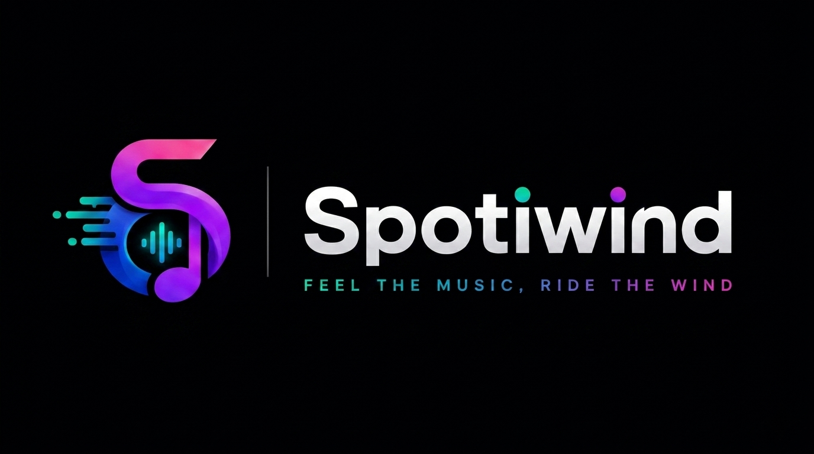

## Spotiwind - Feel The Music, Ride The Wind.

Spotiwind adalah platform musik modern dengan desain futuristik dan responsif yang dirancang untuk menghadirkan pengalaman mendengarkan musik yang nyaman dan premium.

Website ini mengusung desain dark premium dengan kombinasi warna neon purple, pink, dan blue gradient, dipadukan dengan elemen antarmuka modern yang terinspirasi dari platform streaming musik masa kini.

---

## 🎵 Filosofi Nama Spotiwind

Nama Spotiwind merupakan kombinasi dari dua unsur:

- Spoti → terinspirasi dari kata Spot yang berarti tempat atau ruang untuk menemukan dan menikmati musik.
- Wind → terinspirasi dari nama Winanda yang menjadi bagian dari inspirasi project ini.

Nama Spotiwind mencerminkan sebuah platform musik modern yang menggabungkan kreativitas, teknologi, dan pengalaman pengguna dalam satu identitas yang unik.

Tagline :

« Feel The Music, Ride The Wind. »

---

## 💻 Teknologi yang Digunakan

Frontend

- HTML
- CSS
- JavaScript

Backend

- Firebase Authentication
- Firebase Firestore
- Firebase Realtime Database
- Music Streaming API

---

## ✨ Fitur Utama

- 🔐 Login & Register Authentication
- 🎧 Music player interaktif
- 🔍 Pencarian lagu, album, dan artis
- ❤️ Sistem favorit lagu
- 📂 Library musik pengguna
- 🎼 Kategori musik berdasarkan mood
- 👤 User Account Management
- 📈 Top Artists dan Popular Songs
- 🎨 Dark mode premium dengan neon gradient
- 📱 Responsive design (desktop, tablet, dan mobile)
- ✨ Animasi dan transisi antarmuka yang halus

---

## 📦 Tujuan Pengembangan

Project ini dibuat sebagai:

- Portfolio Frontend Development
- Eksplorasi UI/UX Design
- Latihan Responsive Web Design
- Konsep Platform Streaming Musik Modern

---

## 🚀 Status Project

✅ UI Design Completed

✅ Responsive Layout

✅ Frontend Development

---

## 👨‍💻 Developer

I Wayan Winanda

Frontend Developer dari Bali, Indonesia.

Fokus membangun website modern, responsif, dan visual yang menarik.
