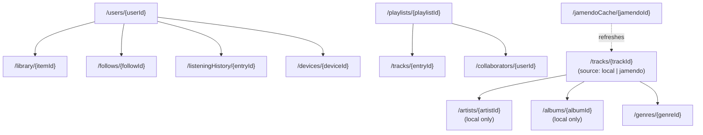

# Database Design Document
## Spotiwind — *Feel the Music, Ride the Wind*

| Field | Detail |
|---|---|
| **Product** | Spotiwind — Music Streaming Platform |
| **Document Type** | Database Schema & Data Architecture |
| **Version** | 2.1 — Firebase Storage Accepted as the One Paid Component |
| **Last Updated** | August 22, 2026 |
| **Status** | Draft — Ready for Engineering Handoff |
| **Related Documents** | `PRD.md` · `DESIGN.md` · `SKILL.md` · `USER-FLOW.md` |
| **v2.1 Change Log** | Local catalog audio moved from Cloudflare R2 back to **Firebase Storage**, by explicit choice — this is now the one deliberately paid line item in the stack. Everything else (Firestore, Auth, Hosting, Functions, Jamendo) stays on free tiers. See §1 and §9. |

---

## Table of Contents
1. [Overview & Why This Stack Changed](#1-overview--why-this-stack-changed)
2. [Data Modeling Philosophy](#2-data-modeling-philosophy)
3. [Collection Structure](#3-collection-structure)
4. [Collection Details](#4-collection-details)
5. [The Two-Source Catalog Model](#5-the-two-source-catalog-model)
6. [Firestore Security Rules](#6-firestore-security-rules)
7. [Indexes](#7-indexes)
8. [Caching Strategy for Jamendo](#8-caching-strategy-for-jamendo)
9. [Local Catalog Storage on Firebase Storage](#9-local-catalog-storage-on-firebase-storage)
10. [Data Retention & Privacy](#10-data-retention--privacy)
11. [Scaling Beyond the Free Tier](#11-scaling-beyond-the-free-tier)
12. [Sample Code](#12-sample-code)

---

## 1. Overview & Why This Stack Changed

| Layer | Technology | Why |
|---|---|---|
| **Primary datastore** | Cloud Firestore (Native mode, Spark/free tier) | Generous free quota (1 GiB storage, 50K reads/day, 20K writes/day, 20K deletes/day, 10 GiB egress/month), built-in real-time listeners (removes the need for a custom WebSocket server), Security Rules act as the authorization layer without a custom backend |
| **Local catalog audio storage** | **Firebase Storage (Blaze plan)** | The one deliberately paid component in this stack — chosen so the whole project stays inside one platform (one console, one SDK, Storage Security Rules alongside Firestore's) rather than adding a second storage vendor. Costs are usage-based, and can often still land at $0 in practice — see §9. |
| **International catalog** | Jamendo API | Free for non-commercial use (35,000 requests/month); Jamendo hosts and streams the audio itself, so Spotiwind never stores or pays for that audio's storage or bandwidth at all |
| **Auth** | Firebase Authentication (Spark/free tier) | Free for standard sign-in methods (email/password, Google) up to 50K MAU |

**Why not the original PostgreSQL + Redis + S3 design from v1.0?** That architecture assumed a funded project with a dedicated backend server. This project is budget-conscious with one deliberate exception (Storage), which changes the right answer:

- **Why Firestore over PostgreSQL**: no server to run or pay for — Firestore is consumed directly by the client (secured by Security Rules, §6), and its free quota is generous enough for an early-stage product.
- **Why Firebase Storage, accepting the cost**: as of **February 3, 2026**, Google requires a linked Blaze (paid) billing account to create or keep a Cloud Storage bucket, regardless of usage. Rather than routing around this with a separate provider, this project accepts it as the one funded piece of infrastructure — in exchange, Storage's Security Rules, SDK, and console all live in the same place as Firestore's. §9 walks through realistic cost expectations, which are often smaller than the "now it's paid" framing suggests.
- **Why Jamendo is still called directly from the client, not through a server**: this was originally to avoid requiring Blaze at all; now that Blaze is linked anyway (for Storage), a server-side Jamendo proxy is technically available if ever wanted (e.g., centralized caching, hiding the `client_id`) — but the client-side approach remains simpler, so it stays the default unless a specific need arises.

The result: **Firestore, Auth, Hosting, and Functions still run at genuinely $0**, governed by the same free quotas as before. Storage is the one line item this project explicitly budgets for — see §9 for what that actually costs.

---

## 2. Data Modeling Philosophy

Firestore is a NoSQL document database — there are no `JOIN`s, and relationships are modeled either by storing a reference ID or by **denormalizing** (duplicating) a small snapshot of related data directly onto the document that needs it. This trades some data duplication for dramatically fewer reads, which matters directly here because reads are the metered, quota-limited resource (§1).

Rules of thumb applied throughout this schema:
- If a screen needs to render a list without a follow-up read per item (e.g., a playlist's track list), **denormalize** the small fields it needs (title, artist name, duration, artwork) directly onto that list entry.
- If data changes independently and often (e.g., a track's live play count), keep it on the source document and accept that dependent views may be slightly stale, rather than fanning writes out everywhere.
- Prefer **subcollections** for one-to-many data that's always accessed in the context of its parent (a playlist's tracks, a user's listening history) over deeply nested arrays, which hit Firestore's 1 MiB document size ceiling on large collections.

---

## 3. Collection Structure

```
/users/{userId}
  /library/{itemId}            (liked tracks, albums, playlists, artists)
  /follows/{followId}
  /listeningHistory/{entryId}
  /devices/{deviceId}
  /playQueue                   (single doc holding the live queue array)
  /subscription                (single doc; see §4.9 — currently unused, see PRD.md §10.4)

/artists/{artistId}             -- local-catalog artists only

/tracks/{trackId}               -- unified: source = 'local' | 'jamendo'

/albums/{albumId}               -- local-catalog albums only

/genres/{genreId}

/playlists/{playlistId}
  /tracks/{entryId}
  /collaborators/{userId}       (Tailwind Playlists only)

/jamendoCache/{jamendoId}        -- short-lived metadata cache, see §8

/notifications/{userId}/items/{notificationId}

/windsockTrending/{scopeId}      -- 'global' or a genreId, aggregated doc

/reports/{reportId}
/auditLogs/{logId}
```



---

## 4. Collection Details

### 4.1 `users/{userId}`
```json
{
  "email": "dinda@example.com",
  "username": "dinda24",
  "displayName": "Dinda",
  "avatarUrl": "https://firebasestorage.googleapis.com/v0/b/spotiwind-app.appspot.com/o/avatars%2Fdinda24.jpg?alt=media",
  "role": "free_user",
  "isVerified": true,
  "privateSession": false,
  "createdAt": "2026-08-22T10:00:00Z",
  "lastLoginAt": "2026-08-22T10:00:00Z"
}
```
`role` mirrors `PRD.md §9`: `free_user | premium_user | artist | admin`. Auth identity (email, password, Google linkage) is managed by Firebase Authentication itself, not stored redundantly here — this document holds only app-level profile data.

### 4.2 `users/{userId}/library/{itemId}`
```json
{
  "itemType": "track",
  "itemId": "jamendo_887209",
  "snapshot": { "title": "Scene 5", "artistName": "WE ARE FM", "artworkUrl": "...", "durationSeconds": 325, "source": "jamendo" },
  "likedAt": "2026-08-22T10:05:00Z"
}
```
`itemType` is one of `track | album | playlist | artist`. The `snapshot` field is a deliberate denormalization (§2) so the Library screen renders from a single collection read.

### 4.3 `artists/{artistId}` (local catalog only)
```json
{ "name": "Nadia Ayu", "bio": "...", "avatarUrl": "https://firebasestorage.googleapis.com/v0/b/spotiwind-app.appspot.com/o/artists%2Fnadia-ayu.jpg?alt=media", "isVerified": false, "createdAt": "2026-08-22T00:00:00Z" }
```
Jamendo artists are **not** duplicated here — their info is fetched from Jamendo (`artists/tracks` endpoint) or read from the denormalized `artistName` already stored on a Jamendo-sourced track.

### 4.4 `playlists/{playlistId}`
```json
{
  "ownerUserId": "uid_dinda",
  "title": "Commute Wind-Down",
  "description": "For the ride home",
  "coverUrl": "https://firebasestorage.googleapis.com/v0/b/spotiwind-app.appspot.com/o/playlist-covers%2Fabc.jpg?alt=media",
  "visibility": "public",
  "isCollaborative": false,
  "collaboratorIds": [],
  "createdAt": "2026-08-22T09:00:00Z",
  "updatedAt": "2026-08-22T09:30:00Z"
}
```

### 4.5 `playlists/{playlistId}/tracks/{entryId}`
```json
{
  "position": 2000,
  "trackRef": { "trackId": "local_tr_0912", "title": "Senja", "artistName": "Nadia Ayu", "durationSeconds": 214, "artworkUrl": "...", "source": "local" },
  "addedByUserId": "uid_dinda",
  "addedAt": "2026-08-22T09:05:00Z"
}
```
`position` uses **fractional/gapped integers** (1000, 2000, 3000, ...) rather than a strict 0,1,2... sequence — inserting a track between positions 1000 and 2000 just needs a new entry at 1500, with no renumbering of the rest of the playlist. This matters especially for Tailwind (collaborative) playlists, where two people could otherwise race to reorder the same list.

### 4.6 `users/{userId}/listeningHistory/{entryId}`
```json
{ "trackId": "jamendo_887209", "playedAt": "2026-08-22T10:10:00Z", "playedDurationMs": 187000, "contextType": "windflow_radio", "contextId": "local_tr_0912" }
```

### 4.7 `genres/{genreId}`
```json
{ "name": "Lo-fi", "colorTag": "#9B4DFF" }
```
`colorTag` feeds the genre-chip theming described in `DESIGN.md §8.8`.

### 4.8 `windsockTrending/{scopeId}`
```json
{ "scope": "global", "updatedAt": "2026-08-22T09:00:00Z", "tracks": [ { "trackId": "local_tr_0912", "title": "Senja", "score": 412 } ] }
```
Recomputed periodically by a Cloud Function that only reads/writes Firestore (no external calls — stays Spark-eligible, §1).

### 4.9 `users/{userId}/subscription`
Present in the schema for forward-compatibility with `PRD.md §10`, but **not populated or read anywhere in the current zero-budget build** — see `PRD.md §10.4`.

---

## 5. The Two-Source Catalog Model

Every track in the app — regardless of origin — is read through the same `tracks/{trackId}` shape, so playback, playlists, and WindFlow Radio never need source-specific branching in the UI layer.

```json
// source: "local"
{
  "source": "local",
  "title": "Senja",
  "artistId": "artist_nadia_ayu",
  "artistName": "Nadia Ayu",
  "albumId": "album_xyz",
  "genre": "Lo-fi",
  "durationSeconds": 214,
  "audioPath": "tracks/local_tr_0912.mp3",
  "artworkUrl": "https://firebasestorage.googleapis.com/v0/b/spotiwind-app.appspot.com/o/covers%2Flocal_tr_0912.jpg?alt=media",
  "bpm": 88,
  "energyScore": 0.34,
  "isExplicit": false,
  "playCount": 1204
}

// source: "jamendo"
{
  "source": "jamendo",
  "title": "Scene 5",
  "artistName": "WE ARE FM",
  "albumName": "Season One",
  "genre": "Electronic",
  "durationSeconds": 325,
  "jamendoId": "887209",
  "jamendoLicenseCcUrl": "https://creativecommons.org/licenses/by-nc-sa/3.0/",
  "artworkUrl": "https://usercontent.jamendo.com?type=album&id=104336&width=300",
  "playCount": 88
}
```

- `trackId` for a Jamendo-sourced track is deterministically `jamendo_<jamendoId>` (e.g. `jamendo_887209`), so re-caching the same track is idempotent (an upsert, never a duplicate).
- `audioPath` (local) is a **Firebase Storage path**, resolved to a playable download URL at request time (§9) — never a full public URL stored ahead of time, so the storage layer can be moved without a data migration.
- Jamendo tracks intentionally do **not** store a long-lived `audio` stream URL in Firestore — it's fetched fresh from Jamendo at play-time (§8), since there's no confirmed guarantee those URLs stay valid indefinitely.
- `jamendoLicenseCcUrl` is stored per-track because Jamendo artists can each choose a different Creative Commons variant (by, by-nc-sa, by-nc-nd, etc.) — keep this alongside the track so attribution/license info can always be surfaced in the UI (e.g., on a track's "Credits" panel).

---

## 6. Firestore Security Rules

Because there's no custom backend gatekeeping every request in this architecture, **Security Rules are the authorization layer**, not an optional extra. Example `firestore.rules`:

```
rules_version = '2';
service cloud.firestore {
  match /databases/{database}/documents {

    function isSignedIn() { return request.auth != null; }
    function isOwner(userId) { return isSignedIn() && request.auth.uid == userId; }
    function isAdmin() {
      return isSignedIn() &&
        get(/databases/$(database)/documents/users/$(request.auth.uid)).data.role == 'admin';
    }

    match /users/{userId} {
      allow read: if isSignedIn();
      allow write: if isOwner(userId);

      match /{subcollection}/{docId} {
        allow read, write: if isOwner(userId);
      }
    }

    match /tracks/{trackId} {
      allow read: if true;        // public catalog data
      allow write: if isAdmin();  // writes only via trusted admin tooling / Cloud Functions
    }

    match /artists/{artistId} { allow read: if true; allow write: if isAdmin(); }
    match /albums/{albumId}   { allow read: if true; allow write: if isAdmin(); }
    match /genres/{genreId}   { allow read: if true; allow write: if isAdmin(); }

    match /playlists/{playlistId} {
      allow read: if resource.data.visibility == 'public'
        || (isSignedIn() && resource.data.ownerUserId == request.auth.uid)
        || (isSignedIn() && request.auth.uid in resource.data.collaboratorIds);

      allow create: if isSignedIn() && request.resource.data.ownerUserId == request.auth.uid;

      allow update, delete: if isSignedIn() && (
        resource.data.ownerUserId == request.auth.uid ||
        (resource.data.isCollaborative == true && request.auth.uid in resource.data.collaboratorIds)
      );

      match /tracks/{entryId} {
        allow read: if get(/databases/$(database)/documents/playlists/$(playlistId)).data.visibility == 'public' || isSignedIn();
        allow write: if isSignedIn() && (
          get(/databases/$(database)/documents/playlists/$(playlistId)).data.ownerUserId == request.auth.uid ||
          (get(/databases/$(database)/documents/playlists/$(playlistId)).data.isCollaborative == true &&
           request.auth.uid in get(/databases/$(database)/documents/playlists/$(playlistId)).data.collaboratorIds)
        );
      }
    }

    match /jamendoCache/{jamendoId} { allow read: if true; allow write: if isAdmin(); }
    match /windsockTrending/{scopeId} { allow read: if true; allow write: if isAdmin(); }

    match /reports/{reportId} {
      allow create: if isSignedIn();
      allow read, update: if isAdmin();
    }
    match /auditLogs/{logId} { allow read, write: if isAdmin(); }
  }
}
```

---

## 7. Indexes

Firestore auto-indexes single fields; **composite** queries need an explicit entry in `firestore.indexes.json`:

| Collection | Composite index | Powers |
|---|---|---|
| `tracks` | `genre ASC, playCount DESC` | Genre-based shelves ordered by popularity |
| `tracks` | `source ASC, genre ASC, bpm ASC` | WindFlow similarity matching within the local catalog |
| `playlists` | `ownerUserId ASC, updatedAt DESC` | "Your playlists," most-recently-edited first |
| `playlists` | `visibility ASC, createdAt DESC` | Public playlist discovery |
| `users/{uid}/listeningHistory` | `playedAt DESC` | "Recently played" (single-field on a subcollection — usually auto-indexed, listed here for completeness) |

---

## 8. Caching Strategy for Jamendo

Jamendo's free tier caps at **35,000 requests/month** (§1) — with client-side calls and a growing user base, that budget disappears fast without caching discipline. The pattern used throughout:

1. **Denormalize on write.** When a Jamendo track is added to a playlist or liked, snapshot its display fields (title, artist, artwork, duration) directly onto that reference document (§4.5, §4.2). Rendering a playlist or library screen **never** calls Jamendo — it only reads Firestore.
2. **Cache popular lookups.** `/jamendoCache/{jamendoId}` stores a short-lived copy of Jamendo's response for tracks that are searched or played often (WindFlow seeds, Windsock trending), with a `cachedAt` timestamp. The app checks this cache before calling Jamendo live, and only refreshes it if the entry is older than a set threshold (e.g., 24 hours) — configurable via a Firestore **TTL policy** on an `expiresAt` field so stale entries are pruned automatically rather than growing the collection forever.
3. **Only fetch live for playback.** The actual `audio` stream URL is requested fresh from Jamendo at the moment a track is pressed play, not stored long-term — this is the one call type that can't be cached away, so it's the one place the request budget is deliberately spent.

---

## 9. Local Catalog Storage on Firebase Storage

- **Why keep it inside Firebase**: Storage Security Rules (`storage.rules`) live in the same project as Firestore's rules, use the same SDK and the same console — one platform to operate instead of two. This is the trade-off being made in exchange for the cost below.

- **Region choice directly determines cost**. Cloud Storage for Firebase requires the Blaze plan to provision a bucket at all (since February 3, 2026), but *what you actually pay* still depends on region:
  | Region choice | Cost behavior |
  |---|---|
  | `us-central1`, `us-east1`, or `us-west1` (US) | Stays eligible for Google Cloud Storage's **"Always Free" tier**: 5 GB-months of storage + 100 GB/month of egress at no cost, even on Blaze. A modest local catalog can realistically stay at **$0**. |
  | `asia-southeast1` (Singapore) / `asia-southeast2` (Jakarta) — better latency for Indonesian listeners | **No free allowance** — billed from the first byte, at the rates below. |

  **Recommendation**: start in a US region to validate the product at $0 (streaming latency to Indonesia is a real but non-blocking trade-off for an early-stage catalog), and revisit the region only once real usage justifies optimizing for local latency.

- **Realistic Blaze rates beyond any free allowance**: storage ≈ **$0.020–0.026/GB-month**; egress (downloads/streaming) ≈ **$0.12–0.15/GB**. A concrete reference point from a typical small app: **10GB stored + 50GB/month streamed ≈ $6–7/month total**. Operations (uploads/downloads as discrete actions) are priced too, but are small enough relative to storage/egress not to be the deciding factor.

- **Cost-reduction tip**: front frequently-streamed files with Firebase Hosting rewrites once volume grows — Hosting's CDN-cached bandwidth is metered separately (and more cheaply) than repeat direct Storage downloads.

- **Bucket layout**:
  ```
  gs://spotiwind-app.appspot.com/
    tracks/{trackId}.mp3          -- local catalog audio, 128–160kbps AAC/Opus recommended
    covers/{trackId}.jpg
    playlist-covers/{playlistId}.jpg
    avatars/{userId}.jpg
    artists/{artistId}.jpg
  ```

- **Access pattern**: files resolve to Firebase's standard download URL — `https://firebasestorage.googleapis.com/v0/b/{bucket}/o/{encoded-path}?alt=media` — generated via the SDK's `getDownloadURL()`. `audioPath` (§5) stores only the internal path (e.g. `tracks/local_tr_0912.mp3`), keeping URL-generation logic in one place so the bucket or region can change later without a data migration.

- **Storage Security Rules** (`storage.rules` — a separate file from `firestore.rules`, same rules-language style):
  ```
  rules_version = '2';
  service firebase.storage {
    match /b/{bucket}/o {
      match /tracks/{fileName} { allow read: if true; allow write: if false; }
      match /covers/{fileName} { allow read: if true; allow write: if false; }
      match /avatars/{userId}/{fileName} {
        allow read: if true;
        allow write: if request.auth != null && request.auth.uid == userId;
      }
    }
  }
  ```
  Catalog audio and cover art are admin-managed (uploaded through a trusted process, not directly by end users) — client writes stay disabled for `tracks/` and `covers/`; user-owned paths like avatars allow only the owning user to write their own file.

- **Capacity planning**: at 128–160kbps, storage cost alone is on the order of a few cents per song per month once beyond any free allowance — for a curated local Indonesian catalog of a few hundred to a couple thousand songs, storage is rarely the dominant cost. **Egress from actual listening is the number to watch** as the user base grows, since it scales with streams, not catalog size.

- **CORS**: configure the bucket's CORS policy (via `gsutil cors set` or the Cloud Console) to allow `GET` from the app's domain(s) so the browser-based player can stream directly without a proxy.

---

## 10. Data Retention & Privacy

- `listeningHistory` is kept for personalization; a scheduled Cloud Function (internal-only, Firestore-to-Firestore, Spark-eligible per §1) can roll old entries into per-user monthly aggregates to keep the collection lean against the 1 GiB Firestore quota.
- Account deletion anonymizes `listeningHistory` (removing the `userId` link) and deletes the `users/{userId}` document and its subcollections outright.
- `users/{userId}.privateSession`, when true, suppresses writes to `listeningHistory` for that session — the client simply skips the write, since there's no backend to enforce it server-side in this architecture (documented here as a deliberate trust boundary of the current design).

---

## 11. Scaling Beyond the Free Tier

Storage already runs on Blaze from day one (§9) — the table below covers what happens to the *other* services, which still start on Spark and only involve new cost if their own usage grows:

| When this happens | What changes |
|---|---|
| Firestore reads/writes/deletes exceed the daily Spark quota | Blaze is already linked (for Storage), so this doesn't require a new billing setup — the free Firestore quotas simply stop hard-stopping and start billing overage instead |
| Firebase Storage usage exceeds the region-dependent free allowance (§9) | Billed automatically at the rates in §9 — no action needed beyond monitoring |
| Want server-side Jamendo calls (e.g., to hide the `client_id` or add response caching Cloud-Function-side) | Already possible now that Blaze is linked — a design choice rather than a blocker, though `SKILL.md §6`'s client-side approach remains the simpler default |
| Real monetization begins | Revisit `PRD.md §10.4` (Jamendo commercial terms) before scaling ad/subscription traffic against Jamendo-sourced content |

**Because Blaze is linked from the start, set a Google Cloud Budget Alert immediately** — e.g., at the equivalent of $1–3 — so any unexpected usage on *any* service surfaces early. This matters more than usual here: linking Blaze removes Spark's automatic hard-stop protection **project-wide**, not just for Storage, so keeping Firestore/Auth/Hosting/Functions at their intended $0 is now a monitoring responsibility rather than something enforced automatically.

---

## 12. Sample Code

**Fetch a user's liked tracks (Firestore, client SDK):**
```javascript
import { collection, query, where, getDocs } from "firebase/firestore";

const q = query(collection(db, `users/${userId}/library`), where("itemType", "==", "track"));
const snapshot = await getDocs(q);
const likedTracks = snapshot.docs.map(doc => doc.data().snapshot);
```

**Search Jamendo directly from the client, then cache the result:**
```javascript
const res = await fetch(
  `https://api.jamendo.com/v3.0/tracks/?client_id=${JAMENDO_CLIENT_ID}&format=json&limit=20&namesearch=${encodeURIComponent(query)}`
);
const { results } = await res.json();

// Cache each result for future reads without re-calling Jamendo
await Promise.all(results.map(track =>
  setDoc(doc(db, "jamendoCache", track.id), { ...track, cachedAt: serverTimestamp() })
));
```

**Get a playlist with its ordered tracks (no extra reads needed thanks to denormalization, §4.5):**
```javascript
const tracksSnap = await getDocs(
  query(collection(db, `playlists/${playlistId}/tracks`), orderBy("position"))
);
const orderedTracks = tracksSnap.docs.map(d => d.data().trackRef);
```

---
*End of DATABASE.md — see `SKILL.md` for how this schema is provisioned, secured, and deployed.*
