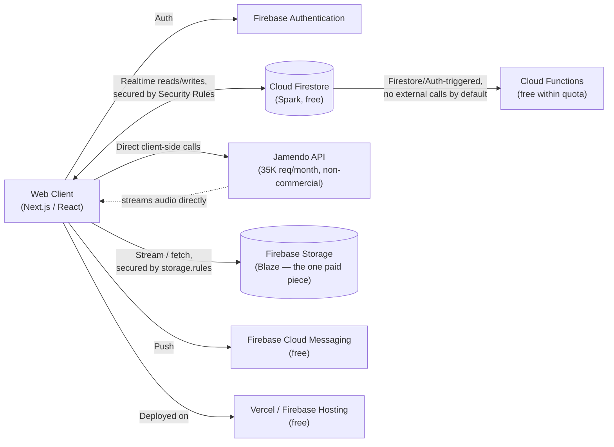
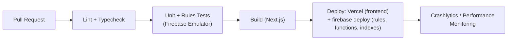

# Technical Stack & Engineering Guide
## Spotiwind — *Feel the Music, Ride the Wind*

| Field | Detail |
|---|---|
| **Product** | Spotiwind — Music Streaming Platform |
| **Document Type** | Technical Stack, Required Skills & Engineering Conventions |
| **Version** | 2.1 — Firebase Storage Accepted as the One Paid Component |
| **Last Updated** | August 22, 2026 |
| **Status** | Draft — Ready for Engineering Handoff |
| **Related Documents** | `PRD.md` · `DESIGN.md` · `DATABASE.md` · `USER-FLOW.md` |
| **v2.1 Change Log** | Local audio/image storage moved from Cloudflare R2 back to **Firebase Storage (Blaze plan)** — a deliberate, explicit choice to keep the whole stack on one platform. It's the one line item this project budgets for; everything else stays free. See §3, §7, §12. |

> **Purpose of this document.** This is the engineering companion to `PRD.md`. It defines the recommended technology stack, the skills needed to build and operate it, and the conventions that keep the codebase consistent — for a human team, a solo builder scoping their own learning path, or an AI coding assistant (e.g. Claude Code) picking up this project and needing shared context fast. Treat this file, `DESIGN.md`'s token reference, and `DATABASE.md`'s schema as binding conventions, not suggestions.

---

## Table of Contents
1. [Technology Stack](#1-technology-stack)
2. [Required Skills by Role](#2-required-skills-by-role)
3. [Architecture & Budget Decisions](#3-architecture--budget-decisions)
4. [System Architecture](#4-system-architecture)
5. [Project Structure](#5-project-structure)
6. [Jamendo API Integration](#6-jamendo-api-integration)
7. [Firebase Storage Setup](#7-firebase-storage-setup)
8. [Coding Standards](#8-coding-standards)
9. [Environment & Configuration](#9-environment--configuration)
10. [Performance Budget](#10-performance-budget)
11. [Testing Strategy](#11-testing-strategy)
12. [Operating Limits & Costs (Reference Table)](#12-operating-limits--costs-reference-table)
13. [Security Practices](#13-security-practices)
14. [Deployment Pipeline](#14-deployment-pipeline)
15. [Notes for AI-Assisted Development](#15-notes-for-ai-assisted-development)

---

## 1. Technology Stack

| Layer | Technology | Rationale |
|---|---|---|
| **Frontend framework** | Next.js (React, TypeScript) | File-based routing, fast first paint, large ecosystem |
| **Styling** | Tailwind CSS + CSS custom properties from `DESIGN.md §17` | Tokens are the source of truth; Tailwind config maps onto them |
| **Animation** | Framer Motion | Matches the easing/duration tokens in `DESIGN.md §10` |
| **Client state** | Zustand (player/queue) + Firestore's own real-time listeners for server state | No separate server-state cache library needed — Firestore's `onSnapshot` covers it |
| **Auth** | Firebase Authentication | Free for email/password + Google OAuth up to 50K MAU — Auth's own quota stays $0 regardless of the Blaze plan already linked for Storage |
| **Database** | Cloud Firestore (Spark/free tier) | See `DATABASE.md §1` for full reasoning |
| **Local audio & image storage** | **Firebase Storage (Blaze plan)** | The one deliberately paid component in this stack (§3) — keeps Storage's Security Rules, SDK, and console unified with Firestore's instead of adding a second vendor |
| **International catalog** | Jamendo API | Free, non-commercial tier, 35,000 requests/month; audio hosted and streamed by Jamendo itself |
| **Serverless functions** | Cloud Functions (Spark, internal-only by default) | Firestore/Auth-triggered logic; external network calls are now technically available too since Blaze is linked (for Storage), but stay unused by default for simplicity (§6) |
| **Frontend hosting** | Vercel (Hobby/free tier) or Firebase Hosting (Spark) | Both free; Vercel is simplest for Next.js SSR out of the box |
| **Push notifications** | Firebase Cloud Messaging | Free, unlimited |
| **CI/CD** | GitHub Actions | Free tier minutes cover a project this size |
| **Monitoring** | Firebase Crashlytics + Performance Monitoring | Free, unlimited, already part of the stack |

**Deliberately not used**: a standalone Node/NestJS backend server, PostgreSQL, Redis, AWS S3, Cloudflare R2, and a dedicated search service (Elasticsearch/Algolia) — see §3 for why each was replaced, and `PRD.md §12` for how this could evolve.

---

## 2. Required Skills by Role

### Frontend Engineer
- React + TypeScript, Next.js routing/data-fetching
- Tailwind CSS, design-token-driven styling (read `DESIGN.md` before building any screen)
- Firebase JS SDK (Auth, Firestore real-time listeners) — this replaces most of what would otherwise be "backend API integration" work
- Framer Motion; Web Audio API basics for waveform-reactive UI

### "Backend" Engineer (Firebase-focused, not a traditional server role)
- Firestore data modeling and Security Rules authoring (`DATABASE.md §2, §6`) — this is the actual authorization layer in this architecture
- Cloud Functions for internal triggers (Firestore/Auth events), and a clear understanding of the Spark-vs-Blaze boundary (§3)
- Comfort reading third-party REST API docs (Jamendo) and designing a client-side caching layer around a rate-limited API

### Storage/Media
- Firebase Storage (Cloud Storage) bucket setup, region selection, and Storage Security Rules (`storage.rules`) — distinct from Firestore's rules but similar syntax (`DATABASE.md §9`)
- Basic audio encoding (AAC/Opus at 128–160kbps) to keep storage and egress costs modest

### UI/UX Designer
- Design-token systems (`DESIGN.md`); motion design fundamentals

### QA Engineer
- Firebase Local Emulator Suite for testing Firestore rules and functions offline
- Playwright for cross-browser E2E of critical flows in `USER-FLOW.md`

### Product / Solo Builder
If building solo: **(1)** Next.js + Tailwind to ship UI from `DESIGN.md`, **(2)** Firebase Auth + Firestore basics (there's no separate database server to learn), **(3)** Firestore Security Rules — don't skip this, it's the only thing standing between your data and the internet in this architecture, **(4)** Jamendo API integration + a Firebase Storage bucket for the local catalog, with a Budget Alert set up on day one (§12).

---

## 3. Architecture & Budget Decisions

This section exists because the stack changed more than once during planning, and the reasoning is worth keeping visible rather than silently baked in. The guiding rule for this build: **stay free everywhere except Storage, which is an explicit, accepted exception.**

**Ruled out entirely (stay free, no exceptions):**
- An always-on backend server (Node/NestJS) — needs paid hosting to run continuously; replaced by Firestore consumed directly by the client.
- PostgreSQL/Redis as managed services — Firestore folds database + realtime sync into one free service.
- **Server-side Jamendo calls through Cloud Functions by default** — technically possible now that Blaze is linked (see below), but calling Jamendo **directly from the client** (§6) stays the default because it's simpler, not because it's required for cost reasons anymore.
- **Apple Sign-In** — not a Firebase limitation; Sign in with Apple requires a $99/year Apple Developer Program membership. Deferred; Google OAuth + email/password cover MVP auth needs for $0.

**Accepted as the one paid component: Firebase Storage.** As of **February 3, 2026**, Google requires a linked Blaze (paid) billing account to create or keep a Cloud Storage bucket, regardless of usage. Two options existed here:
1. Route around it entirely with an external provider (e.g., Cloudflare R2) — the zero-cost path.
2. **Accept Storage's cost and keep everything inside Firebase** — one console, one SDK, Storage Security Rules living alongside Firestore's.

This project deliberately chose **option 2**. In practice this is often a smaller cost than it sounds: Google Cloud Storage's own "Always Free" tier (5 GB-months storage, 100 GB/month egress) still applies on Blaze for buckets in US regions, so a modest catalog can realistically still land at or near $0 — see `DATABASE.md §9` for the full cost breakdown and region trade-offs.

**An important side effect of linking Blaze for Storage**: it removes Spark's automatic hard-stop protection for the *entire* project, not just Storage. Firestore, Auth, Hosting, and Functions all keep the same free quotas, but exceeding them now bills instead of blocking. Staying at $0 on those services is therefore a matter of **monitoring** (Budget Alerts, §12) rather than something enforced automatically the way it was before.

**What this buys**: a single, coherent platform (Firebase) for everything except the international catalog (Jamendo, which nothing could bring in-house anyway), with one clearly-scoped, monitored cost center instead of a second storage vendor to operate.

---

## 4. System Architecture



Notice what's absent compared to a traditional design: no application server sits between the client and its data. Firestore Security Rules (`DATABASE.md §6`) do the job a backend API's authorization middleware would normally do. This is a deliberate trade — less flexibility than a custom server, dramatically less to run and pay for.

---

## 5. Project Structure

```
spotiwind/
├── app/                        # Next.js App Router
│   ├── (routes)/
│   ├── components/             # buttons, cards, player — per DESIGN.md
│   └── lib/
│       ├── firebase.ts         # Firebase app + Auth + Firestore init
│       ├── jamendo.ts          # Jamendo API client (§6)
│       └── storage.ts          # Firebase Storage URL helpers (§7)
├── storage.rules               # Firebase Storage Security Rules (DATABASE.md §9)
├── functions/                  # Cloud Functions (internal-only, Spark-eligible)
│   └── src/
│       ├── onListen.ts         # e.g. increment track.playCount on a history write
│       └── trending.ts         # scheduled Windsock aggregation (Firestore-only)
├── firestore.rules
├── firestore.indexes.json
└── docs/
    ├── PRD.md
    ├── DESIGN.md
    ├── DATABASE.md
    ├── SKILL.md
    └── USER-FLOW.md
```

There is no `apps/api` in this version — most of what a backend would do is either handled by Firestore + Security Rules directly, or by a Spark-eligible Cloud Function for the few cases that need server-side logic without external calls.

---

## 6. Jamendo API Integration

- **Base URL pattern**: `https://api.jamendo.com/v3.0/<entity>/<subentity>/?client_id=<CLIENT_ID>&format=json&...`
- **Auth**: every request needs a `client_id` query parameter, obtained by registering a free developer account and application at `devportal.jamendo.com`. No OAuth2 flow is needed for catalog reads (search, tracks, artists, albums) — OAuth2 is only required for writing to a Jamendo *user's own* account data, which Spotiwind doesn't need.
- **Key endpoints**:
  | Endpoint | Use |
  |---|---|
  | `/tracks/` | Search/list tracks — supports `namesearch`, `fuzzytags`, `order`, `limit` |
  | `/artists/` , `/artists/tracks/` | Artist info and their tracks |
  | `/albums/` , `/albums/tracks/` | Album info with belonging tracks |
  | `/autocomplete/` | Type-ahead across tracks/artists/albums/tags |
  | `/playlists/` | Jamendo's own community playlists (optional, not core to MVP) |
- **Response shape**: `{ "headers": { "status", "results_count" }, "results": [...] }`. A track result includes `id`, `name`, `artist_name`, `album_name`, `duration`, `image`, `audio` (a direct streaming URL Jamendo serves itself), and `license_ccurl` (that track's specific Creative Commons license — store this per `DATABASE.md §5`).
- **Rate limit**: 35,000 requests/month on the free tier. This is a monthly budget, not a burst limit — design around it with the caching pattern in `DATABASE.md §8`, and monitor consumption in the Jamendo developer dashboard.
- **Licensing — read this before enabling any monetization**: the free API tier is for **non-commercial use only**; Jamendo defines commercial use broadly, including ad revenue. See `PRD.md §10.4` before running ads or subscriptions against Jamendo-sourced content.
- **Client-side usage stays the default**: even though Blaze is now linked (for Storage, §7) and a server-side proxy is technically available, calling Jamendo directly from the browser remains simpler and avoids adding a Cloud Function just to forward a request. Revisit this only if a concrete need shows up (e.g., centralized response caching, hiding the `client_id` from very determined scraping of your own app).

---

## 7. Firebase Storage Setup

1. In the Firebase Console, upgrade the project to **Blaze** (required to create any Storage bucket as of February 3, 2026) and immediately set a **Budget Alert** (§12) — this is the single most important step in this section, since Blaze removes the automatic hard-stop that used to protect the whole project.
2. Choose the bucket **region deliberately**: `us-central1`/`us-east1`/`us-west1` keeps Google Cloud Storage's "Always Free" allowance (5GB storage + 100GB/month egress) even on Blaze; an Asia-Pacific region (better latency for Indonesian listeners) forfeits that allowance and bills from byte one. Start US-region for MVP unless latency is already a proven problem (`DATABASE.md §9`).
3. Deploy `storage.rules` (see `DATABASE.md §9` for the full rule set) — catalog audio/artwork are admin-managed and read-only to clients; user-owned paths (avatars) are writable only by their owning user.
4. Follow the path layout in `DATABASE.md §9` (`tracks/`, `covers/`, `avatars/`, etc.).
5. Encode local catalog audio at 128–160kbps (AAC or Opus) before upload — keeps both storage and egress costs down regardless of exact pricing tier.
6. Set long cache headers (`Cache-Control: public, max-age=31536000, immutable`) on uploaded objects, since audio files are immutable once published — pair this with Firebase Hosting rewrites in front of frequently-streamed files once volume grows, to shift repeat downloads onto Hosting's cheaper cached bandwidth instead of repeat Storage egress.
7. Monitor actual spend in Firebase Console → Usage and Billing, alongside the Google Cloud Budget Alert from step 1 — the goal is for Storage to be the *only* line item that ever shows a nonzero number.

---

## 8. Coding Standards

- **TypeScript strict mode** across the project.
- **Linting/formatting**: ESLint + Prettier, pre-commit hook (Husky) and CI.
- **Naming**: `camelCase` variables/functions, `PascalCase` components, `kebab-case` file names; Firestore field names are `camelCase` to match JS conventions directly (no snake_case mapping layer needed, unlike the old SQL design).
- **Component pattern**: functional components + hooks only.
- **Git branching**: trunk-based, short-lived `feat/`, `fix/`, `chore/` branches.
- **Commits**: Conventional Commits (`feat:`, `fix:`, `docs:`, `refactor:`, `test:`).
- **Code review checklist**: does this respect `DESIGN.md §17` tokens? Does it touch a Firestore collection shape from `DATABASE.md §4` — if so, are the matching Security Rules (§6) and indexes (§7) updated in the same PR? Does any new Jamendo call go through the caching layer (`DATABASE.md §8`) rather than firing on every render?

---

## 9. Environment & Configuration

```
# Firebase (from Firebase Console > Project Settings)
NEXT_PUBLIC_FIREBASE_API_KEY=
NEXT_PUBLIC_FIREBASE_AUTH_DOMAIN=
NEXT_PUBLIC_FIREBASE_PROJECT_ID=
NEXT_PUBLIC_FIREBASE_STORAGE_BUCKET=
NEXT_PUBLIC_FIREBASE_APP_ID=

# Jamendo
NEXT_PUBLIC_JAMENDO_CLIENT_ID=
```

Note that the Firebase web config (including the Storage bucket name) and the Jamendo `client_id` are **meant** to be exposed client-side (they're public identifiers, not secrets) — actual protection comes from Firestore/Storage Security Rules and Jamendo's own per-`client_id` rate limiting, not from hiding these values. No server-side secret management is needed for this phase, since there's no server holding secrets.

---

## 10. Performance Budget

| Metric | Target |
|---|---|
| Largest Contentful Paint | ≤ 2.0s on 4G |
| Time to first audio byte | ≤ 1s broadband / ≤ 2.5s 4G |
| JS bundle (initial route) | ≤ 180KB gzipped |
| Firestore reads per session | Minimize via denormalization (`DATABASE.md §2`) — budget roughly ≤ 30 reads for a typical Home + one playlist view, to keep well inside the 50K/day free quota at realistic user counts |

---

## 11. Testing Strategy

| Layer | Tooling | Focus |
|---|---|---|
| Unit | Vitest | WindFlow matching logic, pricing calculations (dormant, §`PRD.md §10.4`) |
| Rules | Firebase Local Emulator Suite + `@firebase/rules-unit-testing` | Verify Security Rules actually enforce ownership/visibility as designed (§6) — this is the single most important test suite in this architecture |
| Component | React Testing Library | Player controls, empty/error states matching `DESIGN.md §16` copy |
| End-to-end | Playwright | Critical paths from `USER-FLOW.md` (onboarding, first play, create playlist) |
| Manual | — | Audio edge cases: backgrounding, network loss mid-playback, Jamendo request-cap behavior |

---

## 12. Operating Limits & Costs (Reference Table)

A single place to check "will this cost anything" before shipping a feature. Figures reflect each provider's published rates as of August 2026 — reverify periodically, as these have changed before (Firebase Storage's Spark eligibility did, in February 2026).

| Service | Free allowance | Cost beyond it |
|---|---|---|
| Firestore | 1 GiB stored, 50K reads/day, 20K writes/day, 20K deletes/day, 10 GiB egress/month | ~$0.06/100K reads, ~$0.18/100K writes, ~$0.18/GiB stored — billed automatically now that Blaze is linked (no hard stop) |
| Firebase Auth | Free for email/password + Google up to 50K MAU | Beyond 50K MAU, Google Cloud pricing applies |
| Firebase Hosting | 10GB stored, 10GB/month transfer | ~$0.15–0.20/GiB transfer beyond that |
| Cloud Functions | Base invocation quota (internal calls); 2M invocations/month typical allowance | ~$0.40/million invocations beyond quota, plus compute time |
| **Firebase Storage** *(the accepted paid component)* | **US-region buckets**: 5 GB-months storage + 100GB/month egress at $0 (GCS "Always Free" tier, still applies on Blaze). **Asia-Pacific buckets**: no free allowance. | ~$0.020–0.026/GB-month storage, ~$0.12–0.15/GB egress. Worked example: 10GB stored + 50GB/month streamed ≈ **$6–7/month**. See `DATABASE.md §9`. |
| Jamendo API | 35,000 requests/month, non-commercial use only | Requests beyond the cap fail; commercial use requires contacting Jamendo directly |
| Apple Developer Program | N/A — $99/year flat, unrelated to usage | Required only if/when Apple Sign-In or an iOS App Store release is added |

**Because Storage requires Blaze, the whole project now has a linked billing account** — which means the automatic protection that used to block Firestore/Hosting/Functions at their free limits is gone project-wide, not just for Storage. **Set a Google Cloud Budget Alert immediately** (Billing → Budgets & alerts) at a low threshold — e.g., Rp 15,000–50,000 (~$1–3) — so the moment *any* service starts costing real money, there's a notification instead of a surprise invoice.

---

## 13. Security Practices

- **Firestore Security Rules are the primary authorization boundary** (`DATABASE.md §6`) — treat any rule change with the same review rigor as an API authorization change in a traditional backend, because in this architecture, it effectively *is* one.
- All traffic over HTTPS/TLS by default (Firebase Hosting, Vercel, and Firebase Storage's own endpoints all enforce this).
- Passwords and session tokens are fully managed by Firebase Authentication — never handled or stored manually.
- **Storage Security Rules** (`storage.rules`, `DATABASE.md §9`) are a second, equally important rules file alongside `firestore.rules` — review changes to it with the same care; it's the only thing standing between the Storage bucket and the internet.
- User-uploaded content paths (avatars, playlist covers) are scoped to the owning user's UID in the path itself (`avatars/{userId}/...`), enforced by `storage.rules`, rather than relying on unguessable filenames alone.
- Jamendo's `client_id` and Firebase's client config are not secrets (§9) — don't spend effort hiding them; spend it on Security Rules and Jamendo's own rate limits instead.
- Dependency scanning via GitHub's Dependabot as a standard CI check.
- Payment data (once monetization activates, `PRD.md §10.4`) is handled entirely via processor tokenization (Stripe/Midtrans) — Spotiwind's own infrastructure never touches raw card data.

---

## 14. Deployment Pipeline



- Every PR runs lint, typecheck, and Firestore Rules tests via the Local Emulator Suite before merge.
- `firebase deploy --only firestore:rules,firestore:indexes,functions` ships backend changes; the frontend deploys separately via Vercel's Git integration (or `firebase deploy --only hosting` if using Firebase Hosting instead).
- No database migrations in the SQL sense — schema changes are a matter of updating `DATABASE.md`, the Security Rules, and any code that reads/writes the changed shape, since Firestore is schemaless at the storage layer.

---

## 15. Notes for AI-Assisted Development

If an AI coding assistant is used to build or extend Spotiwind:

- Treat `DESIGN.md §17` (design tokens) as the only source of color/spacing/typography values.
- Treat `DATABASE.md §3–§5` as the schema of record for Firestore collections — match field names and shapes exactly rather than improvising.
- **Default** to calling Jamendo directly from the client (§6) rather than routing it through a Cloud Function — simpler, and there's no cost reason to add a server hop now that Blaze is already linked (for Storage).
- **Local catalog audio and images go to Firebase Storage** (§7), not Cloudflare R2 or any other external provider — this was revisited from an earlier draft and is now the deliberate, accepted choice. Don't reintroduce a second storage vendor without being asked.
- Feature naming (WindFlow Radio, Breeze Transitions, Gust Mode, Wind Rewind, Windmap, Windsock, Tailwind Playlists) is fixed brand vocabulary from `PRD.md §7.9` — keep it as-is.
- Monetization code (payment flows, ad insertion) is **dormant by design** (`PRD.md §10.4`) — don't wire it up live without flagging the Jamendo licensing gate first.

---
*End of SKILL.md — see `USER-FLOW.md` for the end-to-end journeys this stack needs to support.*
