# User Flow Document
## Spotiwind — *Feel the Music, Ride the Wind*

| Field | Detail |
|---|---|
| **Product** | Spotiwind — Music Streaming Platform |
| **Document Type** | User Flows & Journey Maps |
| **Version** | 1.0 |
| **Last Updated** | August 22, 2026 |
| **Status** | Draft — Ready for Design & Engineering Handoff |
| **Related Documents** | `PRD.md` · `DESIGN.md` · `DATABASE.md` · `SKILL.md` |

> Diagrams below use Mermaid flowchart syntax and render natively in GitHub, GitLab, Notion, Obsidian, and most modern Markdown viewers/IDE extensions.

---

## Table of Contents
1. [Legend](#1-legend)
2. [New User Onboarding](#2-new-user-onboarding)
3. [Returning User Login](#3-returning-user-login)
4. [Discovery & First Play](#4-discovery--first-play)
5. [Search](#5-search)
6. [Playlist Creation & Management](#6-playlist-creation--management)
7. [Following an Artist](#7-following-an-artist)
8. [Upgrading to Premium](#8-upgrading-to-premium)
9. [WindFlow Radio](#9-windflow-radio)
10. [Cross-Device Continuity](#10-cross-device-continuity)
11. [Artist Upload Flow](#11-artist-upload-flow)
12. [Offline Download (Premium)](#12-offline-download-premium)
13. [Account & Subscription Settings](#13-account--subscription-settings)
14. [Wind Rewind (Annual Recap)](#14-wind-rewind-annual-recap)
15. [Error & Edge Cases](#15-error--edge-cases)
16. [Site Map / Information Architecture](#16-site-map--information-architecture)

---

## 1. Legend

| Shape | Meaning |
|---|---|
| `[Rectangle]` | Screen or system action |
| `{Diamond}` | Decision point |
| `([Rounded])` | Start / end of flow |
| `-->\|label\|` | Transition, labeled with the triggering action |

---

## 2. New User Onboarding

Corresponds to `PRD.md FR-AUTH.1–FR-AUTH.2`.

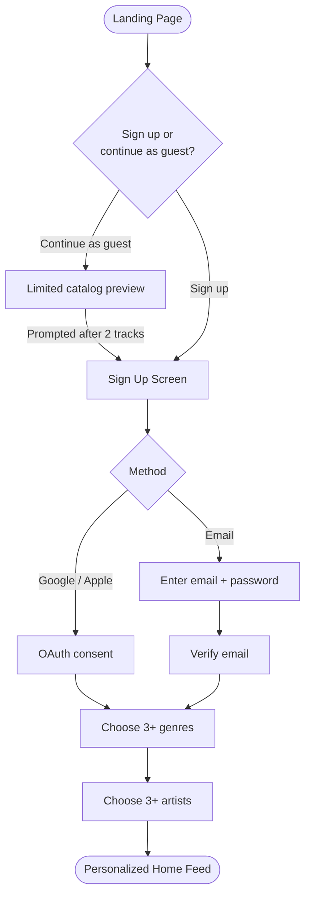

**Design intent** (`DESIGN.md §15`): the genre/artist selection screens use the wind-trail entrance animation per selection, so the onboarding itself already *feels* like the brand before the user has played a single track.

---

## 3. Returning User Login

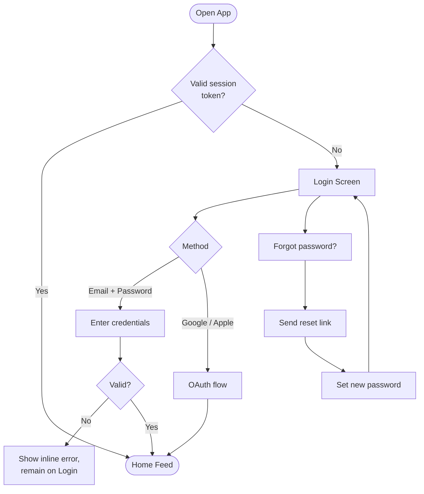

---

## 4. Discovery & First Play

Corresponds to `PRD.md FR-HOME.1`, `FR-PLAYER.1`.

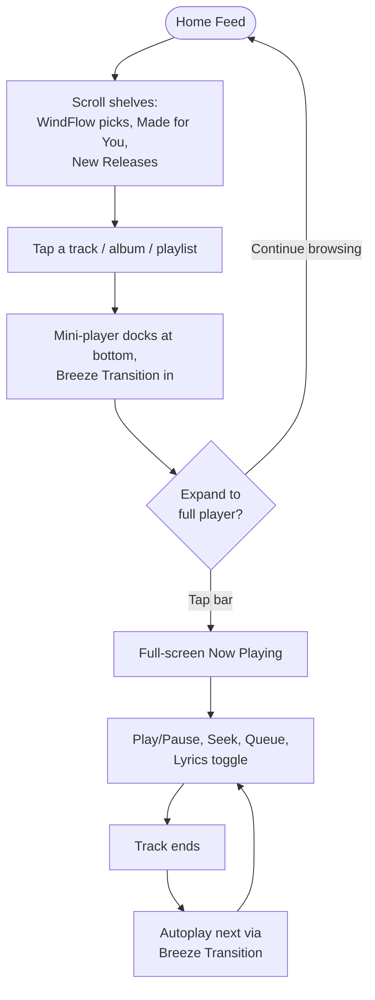

---

## 5. Search

Corresponds to `PRD.md FR-SEARCH.1–FR-SEARCH.2`.

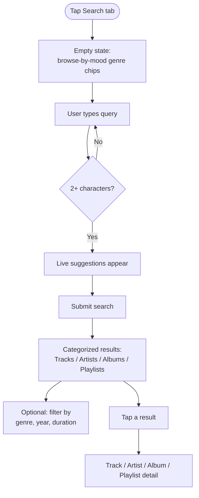

---

## 6. Playlist Creation & Management

Corresponds to `PRD.md FR-PL.1–FR-PL.4`.

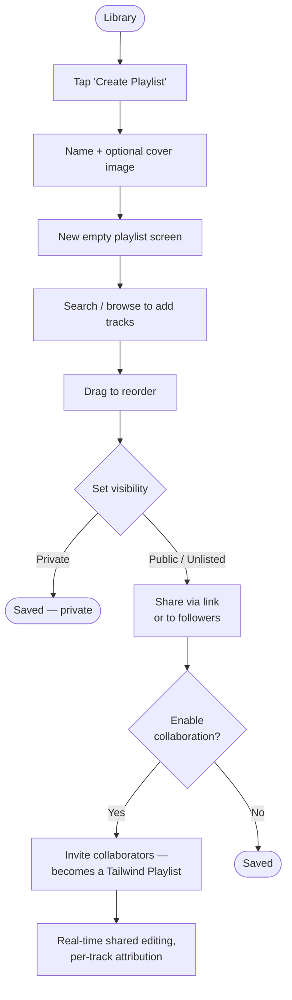

---

## 7. Following an Artist

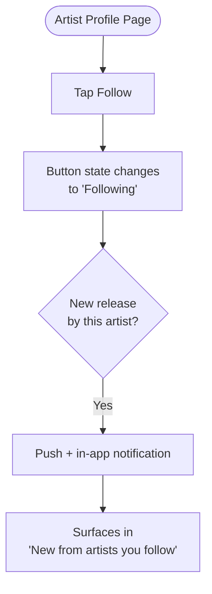

---

## 8. Upgrading to Premium

Corresponds to `PRD.md §10.1`, `FR-SET.2`.

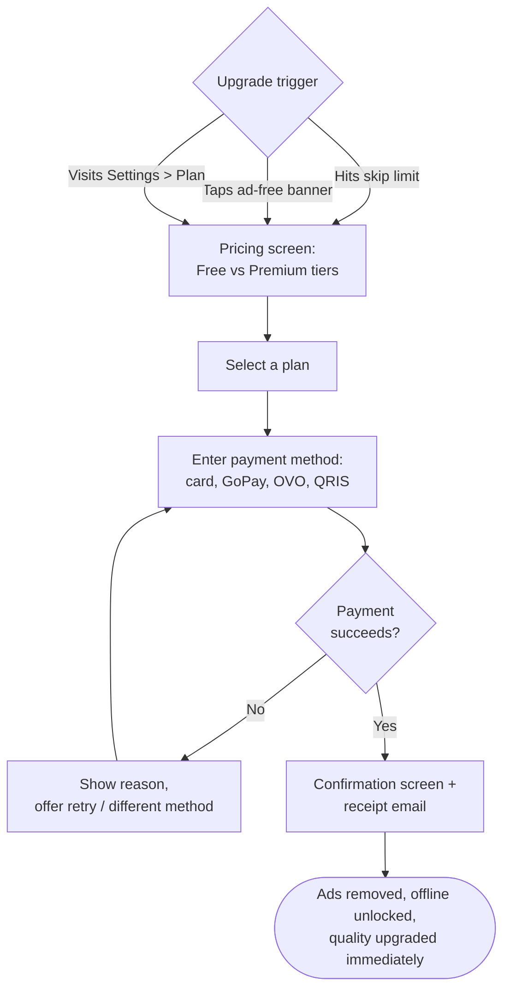

---

## 9. WindFlow Radio

Corresponds to `PRD.md FR-HOME.2` — the product's signature discovery loop.

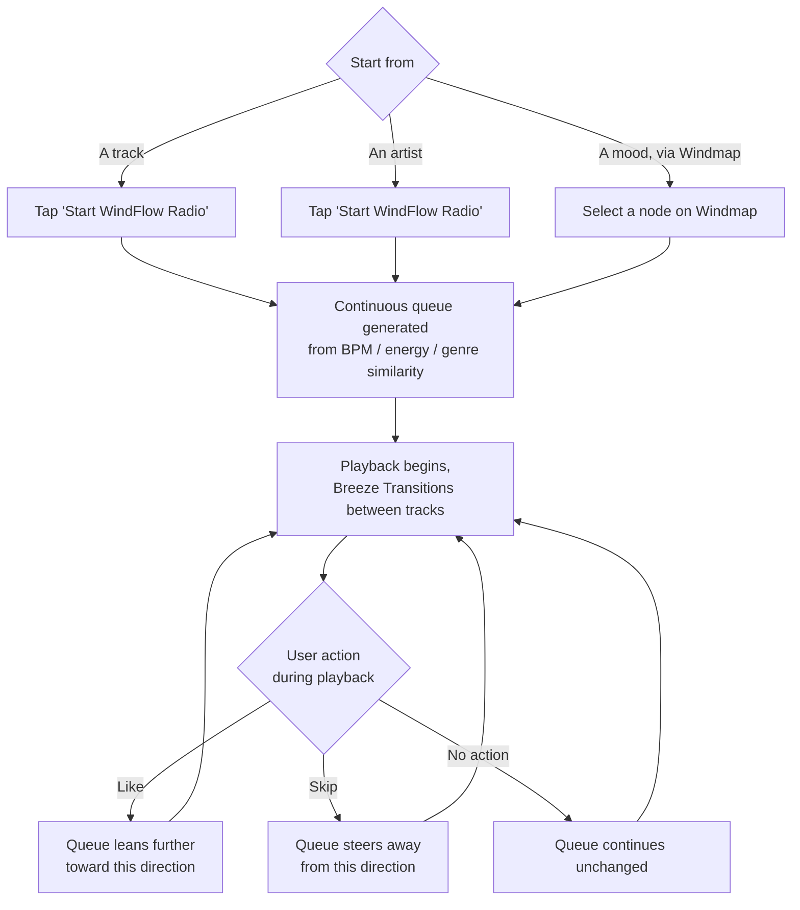

---

## 10. Cross-Device Continuity

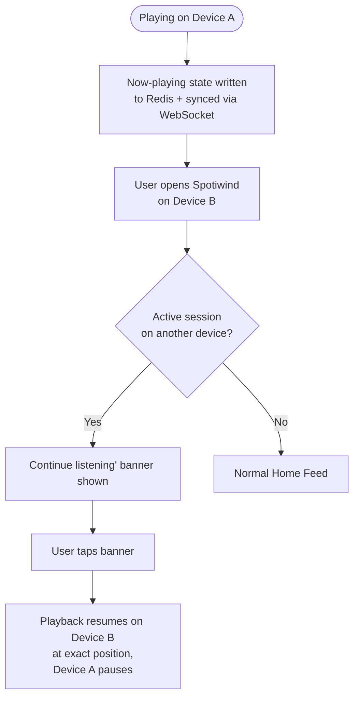

---

## 11. Artist Upload Flow

Corresponds to `PRD.md FR-ART.1`.

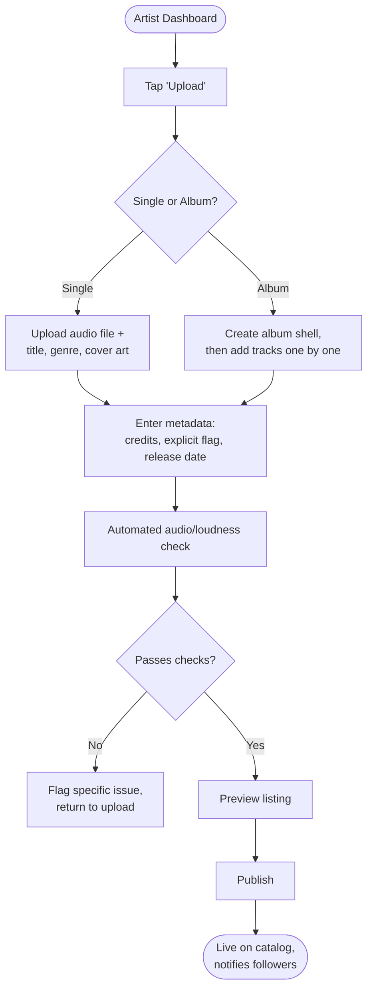

---

## 12. Offline Download (Premium)

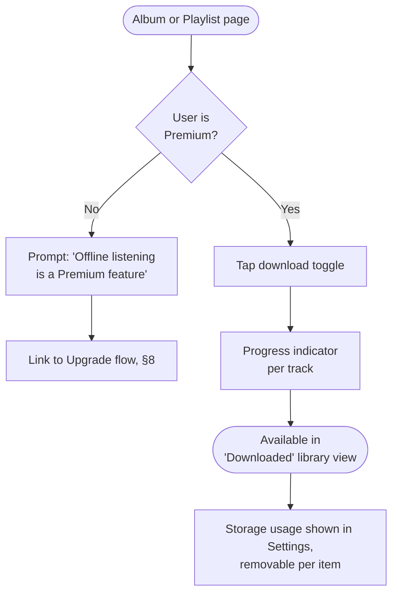

---

## 13. Account & Subscription Settings

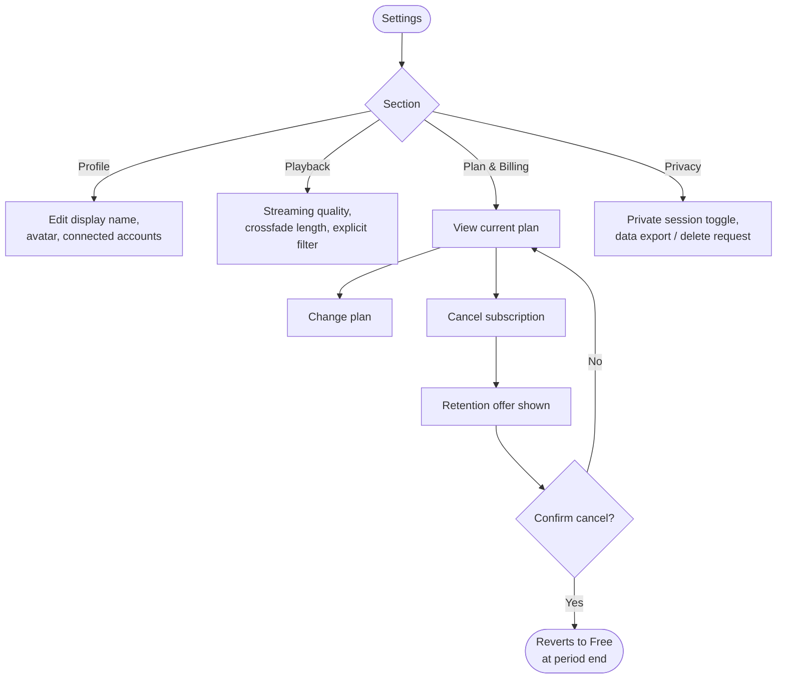

---

## 14. Wind Rewind (Annual Recap)

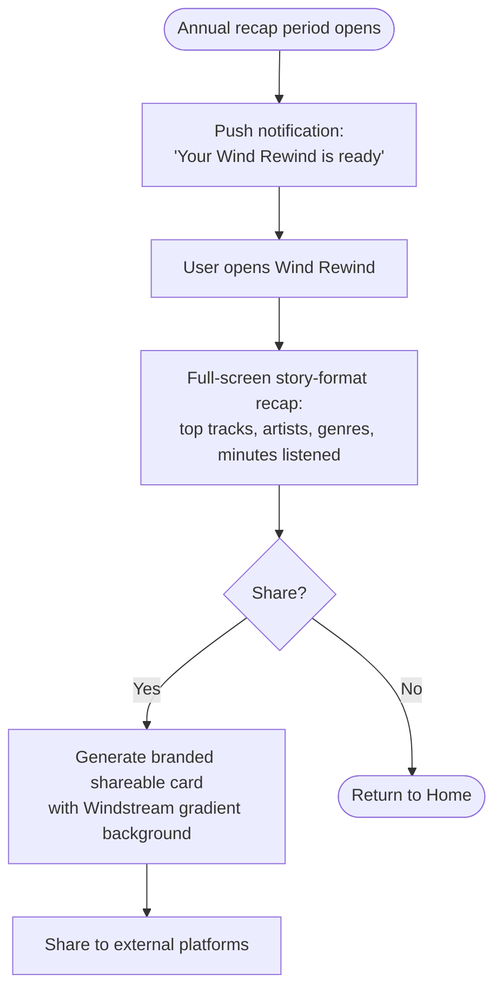

---

## 15. Error & Edge Cases

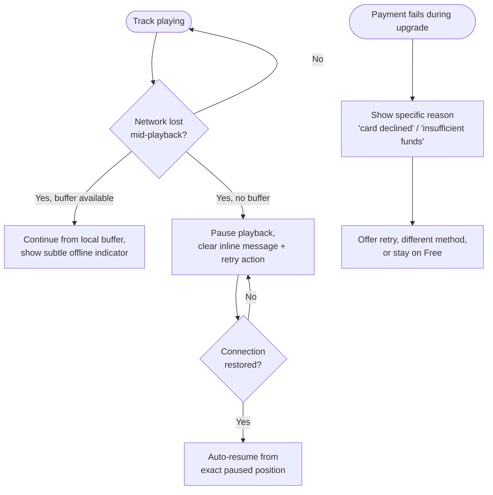

---

## 16. Site Map / Information Architecture

```mermaid
flowchart TD
    Root([Spotiwind]) --> Home
    Root --> Search
    Root --> Library
    Root --> NowPlaying[Now Playing]
    Root --> ArtistDash[Artist Dashboard\n(artist role only)]
    Root --> Settings

    Home --> Shelf1[WindFlow Picks]
    Home --> Shelf2[Made for You]
    Home --> Shelf3[New Releases]
    Home --> Windmap

    Library --> LikedSongs[Liked Songs]
    Library --> Playlists
    Library --> SavedAlbums[Saved Albums]
    Library --> FollowedArtists[Followed Artists]
    Library --> Downloaded

    NowPlaying --> Queue
    NowPlaying --> Lyrics
    NowPlaying --> WindFlowRadio[Start WindFlow Radio]

    Settings --> Profile
    Settings --> PlanBilling[Plan & Billing]
    Settings --> Privacy
    Settings --> Notifications
```

---
*End of USER-FLOW.md — this closes the documentation set alongside `PRD.md`, `DESIGN.md`, `DATABASE.md`, and `SKILL.md`.*
